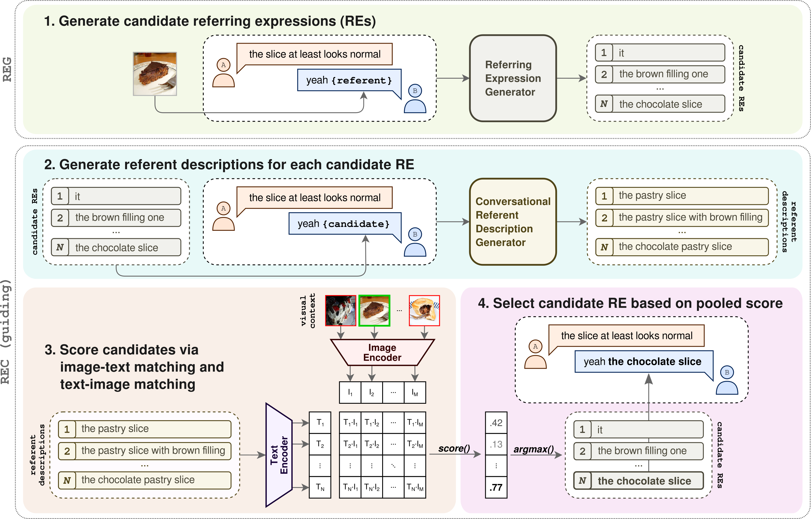

# Referring Expression Generation in Visually Grounded Dialogue with Discourse-aware Comprehension Guiding

> [!NOTE]  
> We are in the process of adding the material described in our paper to this repo.

Repository for the paper "[Referring Expression Generation in Visually Grounded Dialogue with Discourse-aware Comprehension Guiding](https://arxiv.org/abs/2409.05721)" to be presented at [INLG 2024](https://inlg2024.github.io/). 
Please cite the following work if you use anything from this repository or from our paper:

```bibtex
@inproceedings{willemsen-skantze-2024-referring-expression,
    title = "Referring Expression Generation in Visually Grounded Dialogue with Discourse-aware Comprehension Guiding",
    author = "Willemsen, Bram  and
      Skantze, Gabriel",
    editor = "Mahamood, Saad  and
      Minh, Nguyen Le  and
      Ippolito, Daphne",
    booktitle = "Proceedings of the 17th International Natural Language Generation Conference",
    month = sep,
    year = "2024",
    address = "Tokyo, Japan",
    publisher = "Association for Computational Linguistics",
    url = "https://aclanthology.org/2024.inlg-main.38",
    pages = "453--469"
}

```

***

## :scroll: Overview

- [:telescope: The Task](#the-task)
- [:page_facing_up: The Data](#the-data)
- [:spaghetti: The Code](#the-code)
- [:floppy_disk: The LoRA Weights](#the-lora-weights)
- [:printer: The Output](#the-output)

***

## <a name="the-task"></a> :telescope: The Task

In this paper, we ...
> ... propose an approach to referring expression generation (REG) in visually grounded dialogue that is meant to produce referring expressions (REs) that are both discriminative and discourse-appropriate. Our method constitutes a two-stage process. First, we model REG as a text- and image-conditioned next-token prediction task. REs are autoregressively generated based on their preceding linguistic context and a visual representation of the referent. Second, we propose the use of discourse-aware comprehension guiding as part of a generate-and rerank strategy through which candidate REs generated with our REG model are reranked based on their discourse-dependent discriminatory power. 

We fine-tune a generative VLM, [IDEFICS](https://proceedings.neurips.cc/paper_files/paper/2023/hash/e2cfb719f58585f779d0a4f9f07bd618-Abstract-Datasets_and_Benchmarks.html), to serve as our REG model.
We repurpose the *conversational referent description generator* (CRDG) framework of [Willemsen et al. (2023)](https://aclanthology.org/2023.sigdial-1.43/) for ***discourse-aware*** **comprehension guiding**: we use the CRDG to score and, subsequently, rerank candidate REs based on their discourse-dependent discriminatory power.
Figure 1 provides a visualization of the proposed two-stage, four-step framework.

<div align="center"> <p>Figure 1: Visualization of the proposed two-stage, four-step framework. In the first stage, we generate candidate REs with a fine-tuned VLM, conditioning the generation of tokens on the preceding linguistic context and a visual representation of the referent. In the second stage, we use the CRDG framework to score candidate REs on their discourse-dependent discriminatory power: the candidate with the highest pooled score is selected.</p></div>

For more details, we refer the reader to our [paper](https://arxiv.org/abs/2409.05721).

***

## <a name="the-data"></a> :page_facing_up: The Data

We use data from the visually grounded dialogue task "[A Game Of Sorts](https://github.com/willemsenbram/a-game-of-sorts)" for the fine-tuning and evaluation of our proposed method.

In order to reproduce our work you will need the "[A Game Of Sorts](https://github.com/willemsenbram/a-game-of-sorts)" data and [additional annotations](https://github.com/willemsenbram/reference-resolution-via-text-generation):

```
git clone https://github.com/willemsenbram/a-game-of-sorts.git
git clone https://github.com/willemsenbram/reference-resolution-via-text-generation.git
```

For more information about the original dataset, we refer the reader to the "[Collecting Visually-Grounded Dialogue with A Game Of Sorts](https://aclanthology.org/2022.lrec-1.242/)" paper.
For more information about the additional annotations, we refer the reader to the "[Resolving References in Visually-Grounded Dialogue via Text Generation](https://aclanthology.org/2023.sigdial-1.43/)" paper. 

***

## <a name="the-code"></a> :spaghetti: The Code

***

## <a name="the-lora-weights"></a> :floppy_disk: The LoRA Weights

***

## <a name="the-output"></a> :printer: The Output

The generated output on which the results of the experiments reported in the paper are based can be found in `./experiments/output`.

***
